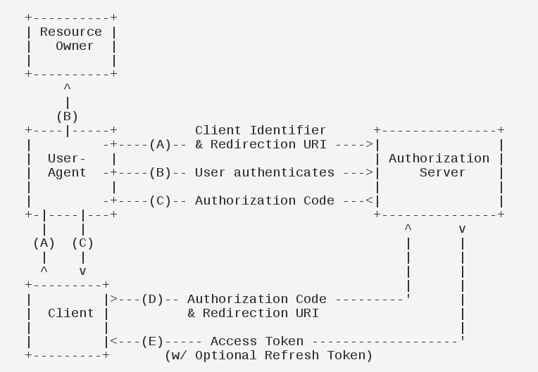

## 授权码模式
### 授权码模式流程
* 用户访问客户端，后者将前者跳转到到授权服务器。
* 用户选择是否给予客户端授权。
* 假设用户给予授权，授权服务器将跳转到客户端事先指定的"重定向 URI"（Redirection URI），同时附上一个授权码。
* 客户端收到授权码，附上早先的"重定向 URI"，向认证服务器申请令牌。这一步是在客户端的后台的服务器上完成的，对用户不可见。
* 认证服务器核对了授权码和重定向 URI，确认无误后，向客户端发送访问令牌。

### 配置
````java
.authorizedGrantTypes("authorization_code")//授权码模式
.redirectUris("http://127.0.0.1:9090/callback")//指定回调地址
````
## 授权码模式流程图

